## colors-rs

[HWB color model](https://en.wikipedia.org/wiki/HWB_color_model)

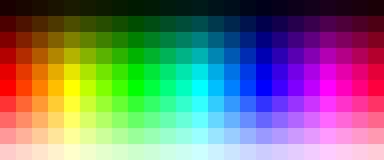 

[HWB — A More Intuitive Hue-Based Color Model](https://www.researchgate.net/profile/Alvy_Smith/publication/240035805_HWB-A_more_intuitive_hue-based_color_model/links/57a8b24b08aef20758cd030e/HWB-A-more-intuitive-hue-based-color-model.pdf)

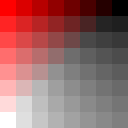 

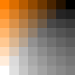 

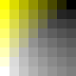 

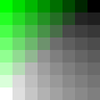 

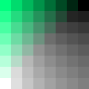 

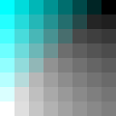 

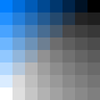 

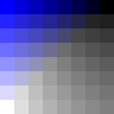 

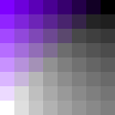 

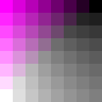 

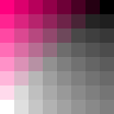 
